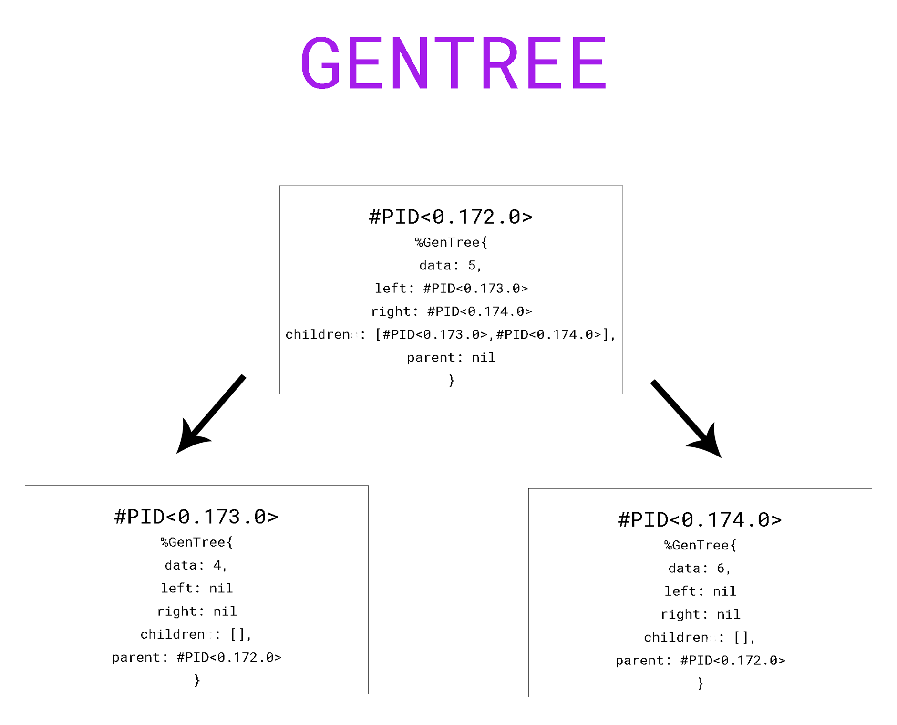

# GenTree

Tree data structure for BEAM in BEAM-way. Each node is a process that contains data and children_pids. The pid is used as pointers.

Tree implementation becomes straight forwards with pointers that can point to a node and a shared state that helps in while performing operations on different nodes, say traversals.
A work around this would be using ```Agents```.

    Agents are a simple abstraction around state.

    Often in Elixir there is a need to share or store state that must be accessed
    from different processes or by the same process at different points in time.

    The Agent module provides a basic server implementation that allows state to be
    retrieved and updated via a simple API.

Thus a node in tree can be described as

  ```elixir
  {:ok, node_pid} = Agent.start(fn -> %{data: "some_data"} end)
  ```



This provides us with a pid which can be used to point to the node and a state that can be manipulated.

1. Start a new tree
    ```elixir
    iex> GenTree.new(5)
    #PID<0.172.0>
    ```

2. Get node data
    ```elixir
    iex> root_pid = GenTree.new(5)
    #PID<0.172.0>
    iex> root_pid |> GenTree.get_node()
    %GenTree.Node{children: [], data: 5, left: nil, right: nil, parent: nil}
    ```

3. Get left or right child
    ```elixir
    iex> GenTree.get_node(root)
    %GenTree.Node{
      children: [#PID<0.221.0>, #PID<0.216.0>],
      data: 1,
      left: #PID<0.216.0>,
      right: #PID<0.221.0>,
      parent: nil
    }
    iex> GenTree.get_left(root)
    #PID<0.216.0>
    iex> GenTree.get_right(root)
    #PID<0.221.0>
    ```
4. If node has a left or right child
    ```elixir
    iex> GenTree.get_node(root)
    %GenTree.Node{
      children: [#PID<0.221.0>, #PID<0.216.0>],
      data: 1,
      left: #PID<0.216.0>,
      right: #PID<0.221.0>
    }
    iex> GenTree.has_left?(root)
    true
    ```

5. Inserting a child to parent in left, right or omitted for general n-ary
    ```elixir
    iex> root = GenTree.new("a")
    #PID<0.228.0>

    iex> GenTree.get_node(root)
    %GenTree.Node{children: [], data: "a", left: nil, right: nil}

    iex> left_child = GenTree.insert_child(root, "b", :left)
    #PID<0.231.0>

    iex> GenTree.get_node(root)
    %GenTree.Node{
      children: [#PID<0.231.0>],
      data: "a",
      left: #PID<0.231.0>,
      right: nil
    }

    iex(25)> GenTree.get_node(left_child)
    %GenTree.Node{children: [], data: "b", left: nil, right: nil}
    ```

6. Builds a tree from a datalist in level-order. Data can have ```nil``` to skip sub-tree.
    ```elixir
    iex> root = GenTree.from_list([1,2,3,4,5])
    #PID<0.398.0>
    
    iex> rl = GenTree.get_left(root)
    #PID<0.399.0>
    
    iex> rlr = GenTree.get_right(rl)
    #PID<0.402.0>
    
    iex> GenTree.get_node(rlr)
    %GenTree.Node{children: [], data: 5, left: nil, right: nil}
    
    iex> GenTree.get_node(rl)
    %GenTree.Node{
      children: [#PID<0.402.0>, #PID<0.401.0>],
      data: 2,
      left: #PID<0.401.0>,
      right: #PID<0.402.0>
    }

    ```

7. DFS tree traversal
    ```elixir
    iex> root = GenTree.from_list([1,2,3,4,5,6])
    #PID<0.378.0>
    iex> GenTree.Traversal.dfs(root, :inorder)
    [4, 2, 5, 1, 6, 3]
    iex> GenTree.Traversal.dfs(root, :preorder)
    [1, 2, 4, 5, 3, 6]
    iex> GenTree.Traversal.dfs(root, :postorder)
    [4, 5, 2, 6, 3, 1]

    ```

8. BFS Tree Traversal
    ```elixir
    iex> root = GenTree.from_list([1,2,3,4,5,6])
    #PID<0.427.0>
    iex> GenTree.Traversal.bfs(root)
    [1, 2, 3, 4, 5, 6]
    
    ```

9. Reducer Function: Invokes reducer_function for each node_pid in the tree with the accumulator.
    ```elixir
    iex> root = GenTree.from_list([1,2,3,nil,4,5,7,nil,nil,8,9])
    iex> GenTree.reduce(root, 0, fn node_pid, acc -> acc + GenTree.get_data(node_pid) end)
    39
    iex> GenTree.reduce(root, [], fn node_pid, acc -> acc ++ [GenTree.get_data(node_pid)] end, [search: :dfs, order: :postorder])
    [4, 2, 8, 9, 5, 7, 3, 1]
    iex> GenTree.dfs(root, :postorder)
    [4, 2, 8, 9, 5, 7, 3, 1]
    iex> GenTree.reduce(root, [], fn node_pid, acc -> acc ++ [node_pid] end, [search: :dfs, order: :postorder]) |>
    ...> Enum.map(fn node_pid -> GenTree.get_data(node_pid) end)
    [4, 2, 8, 9, 5, 7, 3, 1]
    iex> GenTree.reduce(root, [], fn node_pid, acc -> acc ++ [node_pid] end, [search: :dfs, order: :postorder])
    [#PID<0.209.0>, #PID<0.207.0>, #PID<0.212.0>, #PID<0.213.0>, #PID<0.210.0>,
    #PID<0.211.0>, #PID<0.208.0>, #PID<0.206.0>]
    ```
